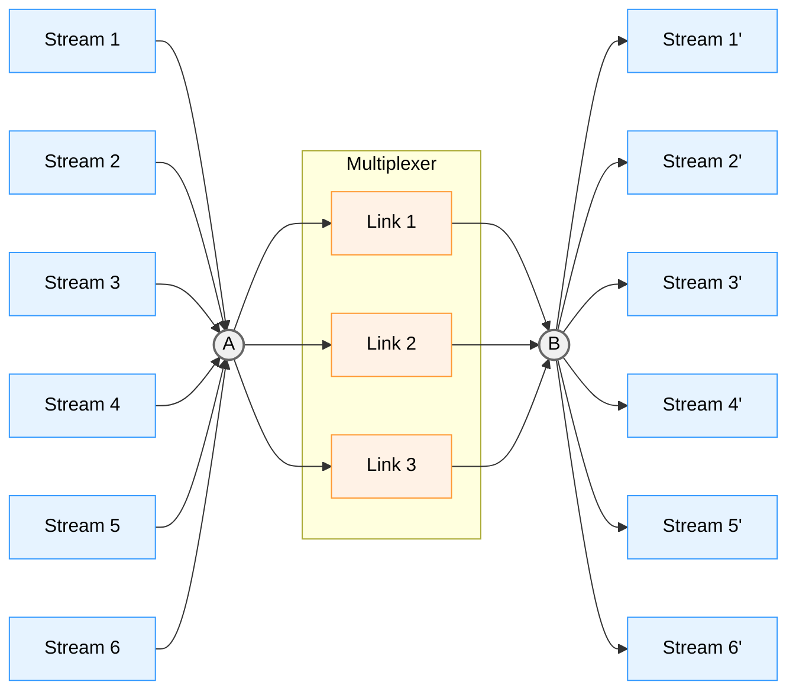

# Multiple Tunnels Multiplexing (mtmux)

mtmux is a Go library that enables multiplexing multiple logical streams over multiple TCP tunnels. It allows for efficient data transfer by distributing the load across several connections, improving performance and reliability.



## Example

Server:

```go
// Get a default configuration
cfg := mtmux.DefaultConfig()

// Listen for incoming connections. This will use the port range from 12345 to 12345 + Tunnels - 1
ln, _ := mtmux.Listen("tcp", "127.0.0.1:12345", int(cfg.Tunnels))
defer ln.Close()
bundle, _ := ln.Accept()

// Create a new server session
session, _ := mtmux.Server(bundle, cfg)
session.Start(context.Background())
defer session.Close()

// Accept a new stream
stream, _ := session.AcceptStream()

// Write and read some data
stream.Write([]byte("hello"))
buf := make([]byte, 1024)
n, _ := stream.Read(buf)

fmt.Println(string(buf[:n]))
```

Client:

```go
// Get a default configuration
cfg := mtmux.DefaultConfig()

// Dial to the server
bundle, _ := mtmux.Dial("tcp", "127.0.0.1:12345", int(cfg.Tunnels))

// Create a new client session
session, _ := mtmux.Client(bundle, cfg)
session.Start(context.Background())
defer session.Close()

// Open a new stream
stream, _ := session.OpenStream()

// Write and read some data
buf := make([]byte, 1024)
n, _ := stream.Read(buf)
_, _ = stream.Write([]byte("world"))

fmt.Println(string(buf[:n]))
```

## Configuration

- `Tunnels`: Number of TCP tunnels to use for multiplexing.
- `KeepAliveInterval`: Interval for sending keep-alive messages.
- `KeepAliveTimeout`: Timeout duration for keep-alive messages.
- `Timeout`: Timeout duration for waiting for missing data frames.
